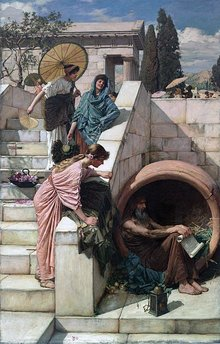
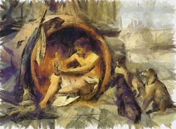

[Wikipedia](https://en.wikipedia.org/wiki/Diogenes)

First of all, thanks for coming to my blog. This will literally be the best, most interesting, and most enjoyable blog you will ever read in your entire life. Well, it will at least be in the top eleven. I would like to start off this stroke of genius with a personal hero of mine, Diogenes. 

Before we can get into the fun, juicy details of this batty man's life, I should preface this by saying that this guy lived about 2500 years ago so it's a little tough to separate fact from fiction. Undoubtedly, some of the following information is merely legend, but, as far as I'm concerned, that doesn't matter. I should also state that I am not a historian and anything I say should not be taken too seriously. I just a (barely) literate guy who likes to waste away his ample free time reading Wikipedia articles instead of getting a job like my girlfriend tells me to. In summation, please don't cite me in your high school history report. Caphiche? Capache.

Diogenes was an Ancient Greek philosopher &#224 la Aristotle, Socrates, or Plato but with a few important differences. For starters, he was homeless, by choice. Diogenes lived in a clay tub in the center of Athens. In fact, Diogenes rejected just about everything in the material world. He destroyed his one possession, a wooden bowl, upon witnessing a boy drinking from the fountain with his cupped hands. Minimalism. He also really didn't a give a hoot what people thought about him and openly mocked the societal norms of the day. He would eat in the Athenian marketplace (for some reason a big no-no at the time), walk around with a lamp in the broad daylight claiming he was "searching for an honest man", masturbate in public saying "if only it were as easy to banish hunger by rubbing my belly", defecate in public, and urinate on people who insulted him. While these actions are disgusting and a little disturbing, one has to admire how few hoots Diogenes gave.

He even had a run-in with Alexander the Great, (the Macedonian one, not me). Alexander had heard of Diogenes and was a bit of a fanboy so he went to meet the philosopher presumably at his tub home. Alexander lived out his groupie fantasy and met Diogenes asking him if there was any favor he could give Diogenes, to which Diogenes replied "stand out of my sunlight." Saying that to anyone is pretty funny but saying it to the literal king of the world is downright badass. Alexander was apparently delighted to be insulted as well. I'm assuming if he were alive today he would love those weird restaurants where you pay the waiters to be assholes to you. Alexander then claimed "if I were not Alexander, then I should wish to be Diogenes." Diogenes replied with another zinger, "if I were not Diogenes, I would still wish to be Diogenes."

Diogenes was the polar opposite of some of his more well-known philosopher counterparts. He despised the teachings of Plato and would consistently cause a scene at his lectures. Once, he roasted Plato pretty hard by showing up at a lecture of his with a plucked chicken exclaiming "Behold! I've brought you a man!" For the uneducated, this is in reference to Socrate's claim that the definition of man is [a featherless biped](https://en.wikipedia.org/wiki/Self-reflection#Classical_antiquity). Plato's Academy then was forced to add "with broad flat nails" to their definition which was really the only thing missing.

**\*\*RHETORICAL QUESTION ALERT!\*\*** So what did Diogenes stand for? Diogenes is credited as a founder of *Cynicism*, a branch of philosophy that is, you know, cynical. While, due to issues with finding primary sources, it is hard to pin down exactly what the Cynics stood for, some people smarter than me think they have a pretty good idea. Generally, a Cynic thought that the artificial parts of society were incompatible with happiness and living a simple life, in harmony with nature was virtuous. They strove to live without any possessions and rejected desires for wealth, power, and fame. Sounds like we could all be a little more Cynical nowadays. Diogenes, living in squalor and being a general menace to society, is considered to be the epitome of the Cynics. Plato said it best when he described Diogenes as "a Socrates gone mad." 

Another fun little tidbit of Big D is that he was often compared to dogs. People aren't sure if someone tried to insult Diogenes by comparing him to a dog or if Diogenes himself started the trend but regardless, Diogenes ran with it. Diogenes described his relationship to dogs as such, "I fawn on those who give me anything, I yelp at those who refuse, and I set my teeth in rascals," and "other dogs bite their enemies, I bite my friends to save them." He really embraced how dogs live, eating whatever they can, shitting whenever they feel like it, and sleeping wherever they can. He also admired how dogs live in the moment and don't worry about philosophy or higher-order, abstract thought. They simply "bark at the truth." The word *Cynic* is even derived from the Greek word for dog.

But, like every other human in history so far, Diogenes did die eventually. Later in his life, he was freaking captured by pirates and sold into slavery (didn't see that coming, did ya?). It would do us well to remember that slavery in Ancient Greece, while still terrible, was usually nowhere near as brutal or racially charged as slavery in the Americas. Diogenes served a man, Xeniades, as a tutor to his children in Corinth. There are tons of stories of what followed in Diogenes life, some stating that he lived out his days in slavery, some stating that he was released shortly after being purchased. There are even more stories about his death, one being that he ate some nasty raw octopus (gross), one stating that he was bitten by a dog (ironic), and one claiming he committed suicide by holding his breath (impressive). 

As I stated above, this dude lived a couple millennia ago so it's really tough to say what actually happened in his life. There are probably five times as many legends as there are truths for his life. But, as far as I'm concerned, it doesn't really matter what is fact and what is fiction. What's important is what Diogenes represents, a big ol' middle finger to the ridiculousness of society. Diogenes reminds us that chasing things like a raise, fame, or finishing an entire season of something on Netflix in one day are all wastes of time and he reminds us in the rudest way possible so that we actually get the message. In conclusion, I am **NOT** telling you to go out to the nearest park and publicly fondle yourself. Rather, I think we could all take Diogenes' message into our own lives and maybe figuratively fondle ourselves in public.